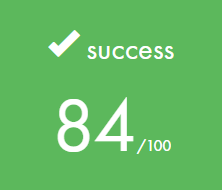

# Push_swap 
This project will make you sort data on a [stack](https://www.geeksforgeeks.org/stack-data-structure-introduction-program/), with a limited set of instructions, using the lowest possible number of actions. To succeed you’ll have to manipulate various types of algorithms and choose the most appropriate solution (out of many) for an optimized data sorting.

### What is push_swap?
Push_swap is an individual project at [42](42sp.org.br) that entails creating a program to sort a stack (stack A) using an auxiliary stack (stack B) with a specific set of commands: [sa, sb, ss, pa, pb, ra, rb, rr, rra, rrb, and rrr](#game-rules). The main challenge lies in implementing an algorithm that achieves sorting with the minimum possible number of operations.

### Overview (push_swap_gui)


#### Badge


#### Objectives
- Sorting algorithms
- Battery concept and handling elements
- Algorithm implementation

#### Skills
- Unix
- Rigor
- Algorithms & AI
- Imperative programming

#### My grade


## Getting started
**Follow the steps below**

```bash
# Clone the project and access the folder
git clone https://github.com/gialexan/push_swap-42 && cd push_swap-42/
# Run make so you can build the library
make
# Execute your program
./push_swap 1 3 2 5 4
# Will output
pb
ra
pb
ra
sa
pa
pa
# Clean output objects with
make fclean
# Well done!
```
## Game rules
- The game is composed of 2 stacks named A and B.
- To start with: A contains randons numbers of either positive or negative numbers without any duplicates. B is empty
- The goal is to sort in ascending order numbers into stack A.
- To do this you have the following operations at your disposal:

<table>
	<thead>
		<tr>
			<th colspan=3><h4>Operations</h4></th>
		</tr>
		<tr>
			<th>op</th>
			<th>description</th>
		</tr>
	</thead>
	<tbody>
	</thead>
		<tr>
			<td align="center">sa</td>
			<td>swap a - swap the first 2 elements at the top of stack a. Do nothing if there is only one or no elements.</td>
		</tr>
		<tr>
			<td align="center">sb</td>
			<td>swap b - swap the first 2 elements at the top of stack b. Do nothing if there is only one or no elements.</td>
		</tr>
		<tr>
			<td align="center">ss</td>
			<td>sa and sb at the same time.</td>
		</tr>
		<tr>
			<td align="center">pa</td>
			<td>push a - take the first element at the top of b and put it at the top of a. Do nothing if b is empty.</td>
		</tr>
		<tr>
			<td align="center">pb</td>
			<td>push b - take the first element at the top of a and put it at the top of b. Do nothing if a is empty.</td>
		</tr>
		<tr>
			<td align="center">ra</td>
			<td>rotate a - shift up all elements of stack a by 1. The first element becomes the last one.</td>
		</tr>
		<tr>
			<td align="center">rb</td>
			<td>rotate b - shift up all elements of stack b by 1. The first element becomes the last one.</td>
		</tr>
		<tr>
			<td align="center">rr</td>
			<td>ra and rb at the same time.</td>
		</tr>
		<tr>
			<td align="center">rra</td>
			<td>reverse rotate a - shift down all elements of stack a by 1. The last element becomes the first one.</td>
		</tr>
		<tr>
			<td align="center">rrb</td>
			<td>reverse rotate b - shift down all elements of stack b by 1. The last element becomes the first one.</td>
		</tr>
	</tbody>
</table>
